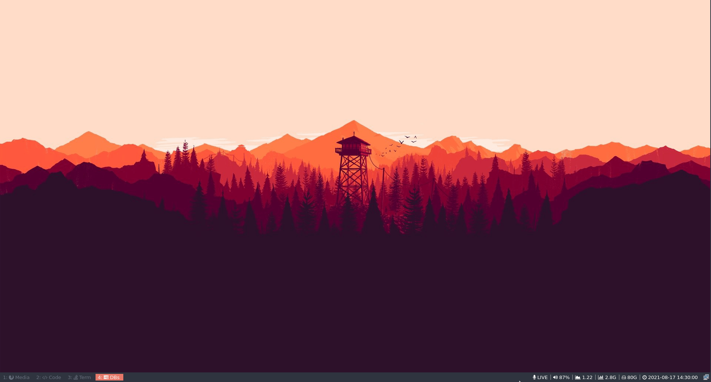

# i3blocks-stop-watch
A stopwatch timer for i3 blocks


### Installing

- Add scripts stopwatch and flip_stopwach to the path. Eg.:

```
sudo cp stopwatch /usr/bin
sudo cp flip_stopwatch /usr/bin
```

- Add the following to the i3blocks.conf:

```
# Stopwatch thing
[stopwatch]
interval=1
command=stopwatch
separator=true
#label=
```

And to the i3 config, add a shortcut to flip the stopwatch state:

```
bindsym mod1+t exec flip_stopwatch
```

On my config `mod1` is `alt`, so I can start and stop the timer with `alt+t`.

Example:


